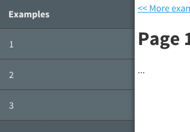

famous-sidepanel
==========

famous-sidepanel is a typical swipe-to-open-menu layout.  




## Getting started

Install using bower or npm

```bash
  bower install famous-sidepanel
  npm install famous-sidepanel
```

## Usage

```javascript
var layout = new SidepanelLayout({
    sidepanel: null,    //RenderNode for sidepanel
    content: null,      //RenderNode for content

    maxPos: 1e4,        // Max position (dragging) (x-coordinate)
    width: 225,         // Open position (x-coordinate)
    transition: {
        duration: 300,
        curve: 'easeOut'
    },
    moveThreshold: 20,  // When should you start moving?
    posThreshold: 138,  // When should sidepanel open?
    velThreshold: 0.75, // When should sidepanel open?
});
this.add(layout);
```

The `sidepanel` and `content` options are mandatory, the rest is optional.

## Contribute

Feel free to contribute to this project in any way. The easiest way to support this project is by giving it a star.

## Contact
-   @markmarijnissen
-   http://www.madebymark.nl
-   info@madebymark.nl

© 2014 - Mark Marijnissen